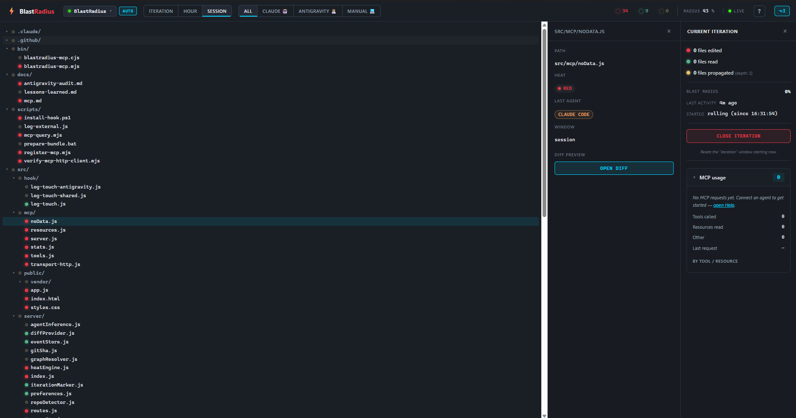

# BlastRadius

> Live impact map of Claude Code edits across your repos.
> Watches what Claude touches, paints the heat in real time, propagates
> change through your import graph, and shows the diff on click.

<p align="center">
  <a href="docs/screenshots/dashboard.png">
    
  </a>
  <br>
  <sub>
    <em>v1.0.0-rc5 — heat map of an active iteration, side panel with file detail,
    iteration metrics, and the live MCP usage panel (right column).</em>
  </sub>
</p>

---

## What it does

BlastRadius is a **local-only dashboard** that observes every file your
Claude Code session reads, writes, or edits, and paints it on a tree
of your repository:

- **🔴 red** &nbsp; — Claude just edited this file.
- **🟢 green** — Claude just read this file (no changes).
- **🟡 yellow** — this file imports something that turned red (the
  "blast radius").
- **⚪ cold** &nbsp; — nothing happened.

It also tracks how much of your repo was touched in different time
windows (current iteration, last hour, full session) and shows the
**git diff** of any red file inline.

It's **read-only** on your repositories. The server never writes to
your code; it only reads files, watches for changes, and runs
`git diff`. The only file it ever writes is its own preferences at
`~/.blastradius/preferences.json`.

### What it does NOT see

BlastRadius is wired specifically into **Claude Code's hook
system**. It does not see:

- Edits made in VSCode, Notepad, JetBrains, Cursor, or any other
  editor or IDE
- File saves from build tools, formatters, or git operations
- Anything happening before you installed the hook

If you make a change to a file by hand and BlastRadius shows nothing,
that's expected. It only lights up for Claude Code's `Read` / `Write` /
`Edit` tool invocations.

### AI Agent Observability (e.g., Antigravity)

While BlastRadius is natively wired into Claude Code's hook system, other advanced agentic AI assistants (such as Google DeepMind's **Antigravity**) can participate in this observability matrix. Because external agents run in independent execution environments without native hooks, they can register their read/edit actions by calling our external CLI utility:

```bash
node scripts/log-external.js --path src/server/routes.js --tool Read
```

This immediately appends the action to the daily JSONL log with the `antigravity-session` identifier. The BlastRadius dashboard will pick it up live and attribute the action directly to `Antigravity` under the **Platform/Agent filter**, allowing human developers and multiple AI agents to collaborate with full visibility of their shared impact footprint.

---

## Quickstart (5 minutes)

### Prerequisites

- **Node.js 18+** in your `PATH`
- **git** in your `PATH` (used by the diff viewer)
- **Claude Code** installed (the CLI or desktop app)
- **Windows** (the launcher is a `.bat`; the rest of the codebase is
  cross-platform, but the install script is PowerShell)

### 1. Install BlastRadius

```bash
cd C:\Users\YOU\Documents
git clone https://github.com/Nurkan1/BlastRadius.git
cd BlastRadius
npm install
```

### 2. Install the hook in each repo you want to observe

```powershell
.\scripts\install-hook.ps1 -ProjectPath C:\path\to\your\repo
```

This creates `<repo>/.claude/settings.json` with a `PostToolUse`
hook that fires after every Claude Code `Edit` / `Write` / `Read`.
The log directory is **baked into the hook command**, so no
environment variable setup is required.

Re-running the script is idempotent — only the BlastRadius entry
is replaced; other hooks in `settings.json` are preserved.

> ⚠️ Claude Code reads `.claude/settings.json` once at **session
> start**. If you have a Claude Code session already open in that
> repo, **restart it** for the hook to take effect.

### 3. Start the dashboard

```cmd
run.bat
```

or with a clean slate (wipes preferences + logs):

```cmd
run.bat CLEAN=1
```

Open <http://localhost:7842>.

### 4. Walk through the first-run wizard

The dashboard asks for a **parent directory** that contains the
repos you want to observe (e.g. `C:/Users/YOU/Documents`).
BlastRadius scans up to 3 levels deep looking for folders that
contain a `.git/` entry.

After the wizard, the dropdown in the header lists every repo it
found, with active ones (recent events) on top and idle ones
greyed out at the bottom. You can click any of them at any time
to switch the dashboard's focus.

### 5. Use Claude Code as you normally would

Every `Edit` / `Write` / `Read` Claude does on a hooked repo lands
on the dashboard in **under 3 seconds**.

---

## AI agent feedback via MCP

Since `v1.0.0-rc3`, BlastRadius ships an embedded **MCP (Model
Context Protocol) server** at `http://localhost:7842/mcp`. Any
MCP-capable agent — Claude Code, Claude Desktop, Antigravity 2.0,
a custom Anthropic SDK client — can consult the live BlastRadius
state and answer questions like "what did I do in the last
iteration?", "summarize today's progress", "what's the diff of the
last red file?". **Strictly read-only**; no agent can close
iterations or switch repos from MCP in this phase.

The full protocol contract, tool / resource list, NO-DATA error
shape, and protocol-version negotiation rules live in
[`docs/mcp.md`](docs/mcp.md). For interactive guidance with
copy-paste commands and sample prompts, open the **in-app Help
modal** in the dashboard via `Ctrl+/` or the `?` button in the
header (`v1.0.0-rc5`+). The quick setup is below.

### One-shot setup with `install-hook.ps1 -RegisterMcp` (`v1.0.0-rc4`+)

If you're already running `scripts\install-hook.ps1` to install the
touch-event hook, the new `-RegisterMcp` flag registers the MCP
server in the matching agent's global config in the same pass:

```powershell
# Both Claude Code and Antigravity in one go
.\scripts\install-hook.ps1 -ProjectPath C:\projects\myrepo -Agent both -RegisterMcp
```

This writes to `%USERPROFILE%\.claude.json` (Claude Code) and
`%USERPROFILE%\.gemini\config\mcp_config.json` (Antigravity 2.0).
Idempotent and preserves every other server already registered.
See [`docs/mcp.md`](docs/mcp.md#option-a--one-shot-setup-via-install-hookps1--registermcp-v100-rc4) for details.

### Connect Claude Code to BlastRadius manually

If you'd rather not use the installer, with the dashboard running
on `:7842` and the `claude` CLI on your PATH:

```powershell
# Register the MCP server (one-time, per user)
claude mcp add --transport http blastradius http://localhost:7842/mcp

# Verify it connected
claude mcp list
# → blastradius   http   http://localhost:7842/mcp   ✓ connected

# Inspect what's exposed
claude mcp get blastradius
# → lists 10 tools + 9 resources + 1 templated resource (rc8+)
```

In any Claude Code session afterwards (even in a different repo),
you can ask things like:

> *"Use BlastRadius to summarize my current iteration."*
>
> *"List the last 5 BlastRadius iterations and tell me which files
> were hottest."*
>
> *"Read `blastradius://heat/session` and identify any unexpected
> red files."*
>
> *"Get the diff of `src/server/heatEngine.js` via BlastRadius."*

Claude Code picks the right tool / resource on its own; you don't
need to memorize names.

### Connect Claude Desktop to BlastRadius (`v1.0.0-rc5`+)

Claude Desktop only accepts the stdio transport — its config
validator rejects the http shape that Claude Code uses. The
installer now ships a bundled stdio shim
(`bin/blastradius-mcp.cjs`) that proxies stdio JSON-RPC to the
dashboard's HTTP MCP endpoint. Register it in one pass:

```powershell
.\scripts\install-hook.ps1 -ProjectPath . -Agent claude -RegisterDesktop
```

Then **fully quit Claude Desktop** (system tray → Quit) and reopen
it. The server appears as `blastradius-observability` in the
connected-MCP list. See [`docs/mcp.md`](docs/mcp.md) for the
rationale behind the rename and the .cjs extension choice — both
empirical workarounds for Claude Desktop config-validator quirks.

### Connect Antigravity 2.0 to BlastRadius

Drop the following into the project's `.agents/mcp.json` (Antigravity
reads MCP servers from this file alongside the existing
`.agents/plugins/blastradius/` hook):

```json
{
  "servers": {
    "blastradius": {
      "transport": "http",
      "url": "http://localhost:7842/mcp"
    }
  }
}
```

Antigravity does **not** hot-reload MCP config — run `/reload` in
the agent (or restart it) for the new server to register. The
existing `plugin.json` + `hooks/hooks.json` from the hook installer
are untouched; MCP is additive.

### Connect a custom Anthropic SDK client

```ts
import { Client } from '@modelcontextprotocol/sdk/client/index.js'
import { StreamableHTTPClientTransport } from '@modelcontextprotocol/sdk/client/streamableHttp.js'

const transport = new StreamableHTTPClientTransport(
  new URL('http://localhost:7842/mcp'),
)
const client = new Client({ name: 'my-tool', version: '1.0.0' })
await client.connect(transport)

const summary = await client.callTool({
  name: 'get_iteration_summary',
  arguments: {},
})
console.log(summary.structuredContent)
```

### What the agent can call

| Surface | Name | Returns |
|---|---|---|
| Tool | `get_iteration_summary` | Current iteration metrics + per-file activity |
| Tool | `summarize_progress` | Per-file Edit/Write/Read aggregation between `since` and `until` (both optional; defaults: iteration window) |
| Tool | `list_recent_iterations` | Iteration windows derived from event gaps |
| Tool | `list_days_with_activity` | Every day with a session-*.jsonl on disk, sorted desc, capped at 30 (`v1.0.0-rc7`+) |
| Tool | `get_file_diff` | Validated git diff of one file (same validator as `/api/diff`) |
| Tool | `get_codebase_graph` | Knowledge Graph nodes + edges with `limit` / `kinds` / `minFanIn` / `withSummaryOnly` filters (`v1.0.0-rc8`+) |
| Tool | `get_nearest_neighbors` | BFS consumers / dependencies for a node, depth ≤ 10 (`v1.0.0-rc8`+) |
| Tool | `describe_node` | Full node detail + 7-day touch-event cross-walk (`v1.0.0-rc8`+) |
| Tool | `find_nodes` | Text search ranked path > tag > summary (`v1.0.0-rc8`+) |
| Tool | `set_node_summary` | **Write**: persist a summary + tags. `annotations.requiresConsent: true` for client-side gating (`v1.0.0-rc8`+) |
| Resource | `blastradius://health` | Server status, uptime, active repo |
| Resource | `blastradius://iteration/current` | Current iteration fused with summary |
| Resource | `blastradius://repo/active` | Active repo path + name |
| Resource | `blastradius://repos` | All detected repos under `parentDir` |
| Resource | `blastradius://events/recent` | Last 100 events on the active repo |
| Resource | `blastradius://graph/summary` | Knowledge Graph stats counters (`v1.0.0-rc8`+) |
| Resource | `blastradius://graph/topology` | Full snapshot capped at 200 nodes (`v1.0.0-rc8`+) |
| Resource | `blastradius://graph/cycles` | Strongly-connected components > 1 + self-loops (`v1.0.0-rc8`+) |
| Resource | `blastradius://graph/orphans` | Files with `fanIn === 0` outside the entry-point allowlist (`v1.0.0-rc8`+) |
| Resource | `blastradius://heat/{window}` | Heat map for `session\|iteration\|hour\|day` |

**Lifecycle:** the MCP server lives in the BlastRadius process. When
you close the dashboard, MCP goes with it. (A future phase will ship
a stdio shim so agents can boot a headless instance on demand.)

**Rate limit:** 100 burst, 30/sec sustained on `/mcp`. Agents that
exceed it get `429 rate_limited` with `Retry-After`.

**Mutations:** **one** as of `v1.0.0-rc8` — `set_node_summary`
persists a per-file summary + tags to `~/.blastradius/knowledge.json`.
It ships with `annotations.readOnlyHint: false` and our additive
`requiresConsent: true` so MCP clients can prompt the user before
firing it. No other surface mutates user data. The HTTP equivalent
(`POST /api/graph/node`) is what the dashboard's inline editor uses;
the MCP tool is reserved for agents.

---

## Local AI planning assistant (`v1.0.0-rc9`+)

The **✦ AI** button in the top bar opens an in-app planning assistant
backed by your own [Ollama](https://ollama.com) daemon. Ask what to do
next, how to approach a change safely, or which library to use — replies
come from a model running **on your machine**.

- **Local-only, by design.** The dashboard's server proxies to Ollama at
  `127.0.0.1:11434` (the browser can't reach it directly under the
  dashboard's CSP). **Nothing leaves your machine** — no cloud, no API
  keys, no cost. This keeps BlastRadius's zero-data-retention identity.
- **Grounded in your live state.** When a repo is active the assistant is
  fed a compact text snapshot of what BlastRadius already knows — edited
  files and who touched them, propagation (blast radius), knowledge-graph
  stats, and your annotations. Ask *"what did I change?"* or *"what does
  editing this affect?"* and it answers from real data, not guesswork.
- **Multilingual.** It replies in the language you write in (BG / ES / EN).
- **Conversations saved per project** — `~/.blastradius/conversations/`,
  with a History dropdown, "New" chat, and a per-project advice counter.
  Each repo is isolated by its full path, so two projects that share a
  folder name never mix histories.
- **Manage the thread** (`v1.0.0-rc9.4`+) — **delete** a conversation (with
  an inline confirm), **Stop** a generation mid-reply (the local model
  stops too), and **Copy** any assistant reply with one click. The panel
  also remembers your last-used model.
- **Image attachments** (`v1.0.0-rc9.4`+) — attach (🖼) or paste an image
  to ask about a screenshot or diagram; needs a vision model (Gemma 3/4).
- **Bigger memory + context warning** (`v1.0.0-rc9.5`+) — the chat asks
  Ollama for a wider context window (`num_ctx` 8192) so long conversations
  remember more, and a bar warns you when the context is filling up
  (before the model silently drops the oldest turns).
- **Full screen + heat-map panel** (`v1.0.0-rc9.5`+) — the ⤢ button expands
  the assistant; in full screen a side panel shows the same heat map the
  AI is grounded in (red/yellow/green files). Click a file to drop its path
  into the composer and ask about it.
- **Explain a change** (`v1.0.0-rc9.6`+) — edited files get an **Explain**
  button: the assistant receives that file's real diff and teaches you what
  changed and why (flagging anything risky). The diff is attached
  server-side, so it never clutters the chat history.
- **Honest session metrics** (`v1.0.0-rc9.6`+) — the assistant knows when the
  session started, the latest activity, and per-agent effort, and can report
  its own token usage. It will **not** invent the coding agent's token count
  (BlastRadius doesn't capture it) — honest by design.
- **Markdown answers** (`v1.0.0-rc9.7`+) — replies render as tables, lists,
  code blocks and proper paragraphs (a tiny dependency-free, escape-first
  renderer — model output is never trusted as HTML). Copy still grabs the
  raw Markdown.
- **Model picker.** Choose any installed chat model. Embedding-only
  models (e.g. `bge`, `nomic-embed`) are listed last — they can't chat.

### Requirements

1. Install Ollama and pull at least one **chat** model:
   ```bash
   ollama pull gemma3        # vision-capable, multilingual
   # or: ollama pull llama3.1 / qwen2.5 / …
   ```
2. Make sure Ollama is running (`ollama serve`, or the desktop app).
3. Open BlastRadius → click **✦ AI**. If Ollama isn't running the panel
   says so and disables sending.

No configuration, no keys. The assistant is read-only with respect to
your code — it only *reads* the BlastRadius state to ground its advice.

---

## Daily use

### Workflow

1. **Open the dashboard** in a browser tab and leave it. (It's
   harmless even when the server is the only thing running — no
   network calls, no analytics, just a tab.)
2. **Work with Claude Code** in any repo where you installed the
   hook. The dashboard updates live.
3. **Click red files** to see exactly what changed (git diff in
   a side-by-side viewer).
4. **Press `Alt+I`** to toggle the *iteration panel*. When you
   start a new piece of work, click "Marcar fin de iteración" to
   reset the iteration clock — the panel then shows you metrics
   for the new iteration only.

### Reading the dashboard

```
┌────────────────────────────────────────────────────────────────┐
│ ⚡ BlastRadius  [IdeaBlast ▾] [auto]  [Iter Hour Session]  …  │  ← header
├────────────────────────────────────────────────────────────────┤
│ ▾ src/                                          │ src/App.tsx │  ← tree (left)
│   ▾ components/                                 │ heat: red   │     side panel (right)
│     🔴 App.tsx                                  │             │
│   ▸ hooks/                                      │ [Open diff] │
│   🟡 main.tsx                                   │             │
│ ▸ tests/                                        │             │
└────────────────────────────────────────────────────────────────┘
```

| UI element | What it means |
|---|---|
| **Repo dropdown** | The active repo. Switch any time without reloading. |
| **`auto` / `manual` pill** | When `auto` is on (default), the server switches the active repo if another repo gets sustained activity (≥30s span). Click to disable. |
| **`Iteration` / `Hour` / `Session`** | Time window for the heat colors. "Iteration" = since last reset (or last 3 min). "Hour" = last 60 min. "Session" = no time filter (everything today). |
| **🔴 N 🟢 M 🟡 K** | Live counters for the current window. |
| **RADIUS X%** | `(red + green + yellow) / totalFilesInRepo × 100`. Higher = more of the repo is "hot". |
| **LIVE / RECONNECTING** | SSE connection status. If it says reconnecting for more than a few seconds, the server probably crashed. |
| **`⌥I` button** | Open or close the iteration panel. Same as the `Alt+I` keyboard shortcut. |

### The iteration panel

The right panel (opens with `Alt+I`) breaks down the **current
iteration** with:

- N edited files / M read files
- K files affected by import propagation
- Blast radius % of the repo
- Time since last activity
- Start timestamp of the current iteration
- A red **"Marcar fin de iteración"** button that resets the
  iteration to "now". The next iteration starts from there.

### Commit investigation (`v1.0.0-rc9.11`+)

The **⎇** button in the top bar opens a commit-investigation panel: browse
recent commits and the files each one touched, then click any file to open
its diff **pinned to that commit** — git archaeology without a terminal. The
heat map shows live agent activity (the event log); this panel is the git
history lens. Read-only.

---

## Screenshots

A walkthrough of the live dashboard captured against a real working
session. Click any image to view full size.

<p align="center">
  <a href="docs/screenshots/dashboard.png">
    
  </a>
</p>

### Annotated regions

| # | Region | What it shows |
|---|---|---|
| 1 | **Header bar** (top) | Active repo selector (`BlastRadius`), `AUTO` vs manual repo-switch pill, time window (`ITERATION` / `HOUR` / `SESSION`), agent filter (`ALL` / `CLAUDE` / `ANTIGRAVITY` / `MANUAL`), live counters (🔴 34 edited · 🟢 9 read · 🟡 0 propagated · `RADIUS 43%`), SSE connection state (`LIVE`), Help button (`?`, opens the in-app guide — see below), and iteration panel toggle (`⌥I`). |
| 2 | **Date-range selector** (header, `v1.0.0-rc7`+) | Pin the heat map to a past day or a custom multi-day window. Presets `TODAY / YESTERDAY / 7d / 30d / CUSTOM…`. While any non-Today preset is active the time-window toggle is disabled (the date range *is* the time filter) and SSE live updates are paused (historical ranges are immutable). |
| 3 | **File tree** (left, two thirds) | Hierarchical view of the active repo. File icons carry the heat color of the current window; folders aggregate the hottest child. Click a red file to open the diff modal; click any file to populate the side panel. |
| 4 | **Side panel** (top-right) | File detail for the selected node: full path, heat color, last touching agent (here: `CLAUDE CODE`), time window, and an "Open diff" shortcut. |
| 5 | **Iteration panel** (right column) | Live metrics for the current iteration (started at, last activity, files edited / read / propagated, blast radius percentage). The big red `CLOSE ITERATION` button resets the iteration window to "now". |
| 6 | **MCP usage panel** (right column, collapsible) | Live counter of MCP requests served by the dashboard's `/mcp` endpoint since boot. Empty state in this capture — connect an agent and the panel populates with per-tool, per-resource, per-client breakdowns updated via SSE. Introduced in `v1.0.0-rc5`. |

### In-app Help

Press `Ctrl+/` or click the `?` button in the header to open the
**Help modal** with four tabs: copy-paste setup commands for every
supported agent (Claude Code, Claude Desktop, Antigravity 2.0,
custom Anthropic SDK clients), the full MCP tools / resources
catalog, ready-to-paste sample prompts for agents (including
end-of-day digest and weekly review prompts that exercise the rc7
date-range tools), and a troubleshooting catalog with the
real-world quirks documented in [`docs/mcp.md`](docs/mcp.md).
Introduced in `v1.0.0-rc5`.

---

## Glossary

### Colors

| Color | Trigger | When it's assigned |
|---|---|---|
| **Red** | `Edit` or `Write` event | A direct mutation by Claude Code. |
| **Green** | `Read` event with no Edit/Write on the same file | The file was inspected but not changed. |
| **Yellow** | Transitive importer of a red file | BFS over the **reverse** import graph (1–3 levels deep, configurable). Only red files propagate; reads do not. |
| **Cold (no color)** | Nothing in this window | The file is not in the heat map at all. |

### Windows

| Window | Time range |
|---|---|
| **Iteration** | Events at or after the last "Marcar fin de iteración" click. If you never clicked it, defaults to the last 3 minutes. |
| **Hour** | Last 60 minutes. |
| **Session** | All events in the current day's log file. No time filter. |

### Repo states (in the dropdown)

| State | Meaning |
|---|---|
| **🟢 active (pulsing dot)** | Currently selected. |
| **active (not pulsing)** | Has events in the last 7 days. |
| **idle (greyed out)** | Detected as a `.git/` directory but no events recorded yet. |

---

## Multi-repo

BlastRadius is designed to observe **multiple repos at once**.

- The hook is installed per-repo (run `install-hook.ps1` once
  per repo). They all write to the same shared log directory.
- The dashboard always shows **one repo at a time** ("the active
  repo"). The dropdown lets you switch.
- With `auto` on, the server switches the active repo when
  another repo gets sustained activity (≥ 2 events spanning ≥30s
  in the last 60s).
- The import graph is built per-repo and cached for 5 minutes.
  Switching repos triggers a graph rebuild for the new one in
  the background (red/green show up immediately; yellow lands a
  second later).

### How to add a new repo to the dashboard

1. `./scripts/install-hook.ps1 -ProjectPath C:\path\to\new\repo`
2. Restart any Claude Code session already open in that repo.
3. Edit any file with Claude Code → the repo flips from idle to
   active in the dropdown.

### How to remove a repo

1. Delete `<repo>/.claude/settings.json` (or just the BlastRadius
   entry if you have other hooks).
2. The repo stays in the dropdown until it falls out of the 7-day
   activity window. The dashboard never deletes anything on its
   own.

---

## Troubleshooting

### The dashboard is empty after editing files

1. **Did you restart Claude Code?** The hook is loaded once at
   session start. Sessions opened before you ran `install-hook.ps1`
   never fire it.
2. **Is the hook actually invoked?** Check the JSONL log:
   ```cmd
   type C:\Users\YOU\Documents\BlastRadius\logs\session-YYYY-MM-DD.jsonl
   ```
   If lines are being added when Claude edits files, the hook
   works and the issue is somewhere on the server.
3. **Is the server still running?** The header badge should say
   `LIVE`. If it says `RECONNECTING` for more than 30 seconds, the
   server crashed. Run `run.bat` again.

### `run.bat` fails: "node not found"

Add Node 18+ to your `PATH`, or edit the bat to use the full path
to `node.exe`.

### The yellow propagation never shows anything

First check `/api/health` and look at the `graph` field:

```cmd
curl http://localhost:7842/api/health
```

- `graph: { modules: 0, builtAt: 0 }` → the import graph never built.
  Most common cause: `dependency-cruiser` choked on a config file.
  Check the launcher console for a red `graph rebuild FAILED` line —
  it includes the underlying error.
- `graph: { modules: <N>, builtAt: <ts> }` with N > 0 → the graph is
  fine; you simply haven't edited a file with consumers in the
  current iteration window.

Other reasons yellow stays empty:
- Your codebase needs **resolvable imports**. JS/TS works out of the
  box (`dependency-cruiser`); TypeScript repos need a valid
  `tsconfig.json`. Python, Go, Rust and Java ship with their own
  zero-dependency resolvers (auto-detected by `requirements.txt` /
  `go.mod` / `Cargo.toml` / `pom.xml` etc.).
- For a language with no built-in resolver yet, the graph is empty,
  so you'll see red/green but never yellow. That's a known limitation.

### The counter says "6 red" but I only see 2 red files in the tree

Make sure your server is on a recent build (the header banner will
say *"Server running stale code …"* if it isn't — restart `run.bat`).
The fix that intersects the heat map with the on-disk tree shipped
in commit `b3ee9b8`; before that, events for `.gitignored` builds,
`node_modules`, or deleted files inflated the counter without ever
appearing in the rendered tree.

### Iteration panel shows "0 files" but I'm actively editing

Your Claude Code session might be running with a different cwd from
the repo you're editing. That used to break attribution, but the
fix in `d54eb77` switched the event-to-repo filter from a strict
`cwd === repoPath` match to "the touched file lives inside the
repo." Confirm the server has that commit (check `/api/health`'s
`serverStartSha`), then verify a touched file actually lives under
the active repo's directory tree.

### Multiple BlastRadius servers piling up after closing the cmd window

Fixed by `5e3f817`: `run.bat` now writes the server PID to
`~/.blastradius/server.pid` on boot and kills the previous one (plus
any `node src/server/index.js` zombies that have no PID file) before
starting a new instance. If you still see drift, run
`tasklist | findstr node` and `taskkill /F /PID <pid>` by hand —
that's the same belt the launcher uses.

### "Server running stale code" banner won't go away

You probably committed a fix on disk but didn't restart the server.
The banner stays until `serverStartSha` (captured at boot) matches
the on-disk HEAD again. Stop the server (Ctrl+C in the launcher),
run `run.bat`, hard-reload the browser (Ctrl+Shift+R), and the
banner clears.

### Hot-reload for development

```cmd
npm run dev
```

uses `node --watch`. Edits to anything `src/server/index.js`
transitively imports trigger a restart. The launcher logs flash
through every restart, so the stale-server banner in the browser
will surface naturally if a restart fails.

(`node --watch` is stable from Node 22; on Node 18.x / 20.x it
prints an experimental-feature warning that we suppress with
`--no-warnings`.)

### I want to change the parent directory

In the dropdown menu (where you switch repos), click
**⚙ Change parent directory…**. A small modal lets you point at
a different directory. If the current repo is no longer a child
of the new parent, the wizard runs again to pick a new repo.

### How do I wipe everything and start fresh?

```cmd
run.bat CLEAN=1
```

This deletes `~/.blastradius/preferences.json` and clears the
JSONL log. The next start drops into the wizard.

### Where are the logs?

Daily JSONL files in `<BlastRadius>/logs/`. The path is fixed at
install time (via the `-LogDir` parameter of `install-hook.ps1`)
and baked into the hook command in `<repo>/.claude/settings.json`.

---

## Architecture

```
   ┌──────────────────────────────────────────────────────────┐
   │                CLAUDE CODE (in observed repo)             │
   │                                                           │
   │   tool: Edit / Write / Read on src/foo.ts                 │
   │            │                                              │
   │            ▼  PostToolUse hook                           │
   │   .claude/settings.json → "node log-touch.js --log-dir…" │
   └──────────────────────────────────────────────────────────┘
                                │ stdin JSON
                                ▼
   ┌──────────────────────────────────────────────────────────┐
   │   HOOK   src/hook/log-touch.js (Phase 1)                  │
   │   • Parse stdin → tool, file_path, session_id             │
   │   • Hash the file (sha256 stream)                         │
   │   • Append one JSONL line to logs/session-YYYY-MM-DD.jsonl│
   │   • Exit in <100ms; never blocks Claude                   │
   └──────────────────────────────────────────────────────────┘
                                │ file system
                                ▼
   ┌──────────────────────────────────────────────────────────┐
   │   SERVER   src/server/                                    │
   │                                                           │
   │   eventStore       — tails the JSONL file (chokidar)      │
   │   treeScanner      — walks repo, respects .gitignore      │
   │   graphResolver    — dependency-cruiser, reverse graph    │
   │   heatEngine       — pure fn: events → {files, metrics}   │
   │   diffProvider     — simple-git diff → diff2html HTML     │
   │   iterationMarker  — in-memory "iteration started at…"    │
   │   repoDetector     — scans parentDir for .git/ folders    │
   │   preferences      — atomic-write ~/.blastradius/prefs    │
   │   sse              — Server-Sent Events broadcaster       │
   │   routes           — Express router (/api/*)              │
   └──────────────────────────────────────────────────────────┘
                                │ HTTP + SSE
                                ▼
   ┌──────────────────────────────────────────────────────────┐
   │   DASHBOARD   src/public/  (browser)                      │
   │                                                           │
   │   index.html  — shell + 3-panel layout                    │
   │   styles.css  — dark theme + heat-color CSS variables     │
   │   app.js      — D3 tree, EventSource, modals              │
   └──────────────────────────────────────────────────────────┘
```

### API summary

| Endpoint | Purpose |
|---|---|
| `GET /api/health` | Liveness probe + diagnostics |
| `GET /api/tree` | Repo tree of the active repo |
| `GET /api/heat?window=iteration\|hour\|session&platform=all\|claude\|antigravity\|manual` | Heat map + metrics, optionally filtered by platform |
| `GET /api/events` | Server-Sent Events stream |
| `GET /api/diff?path=…&against=auto` | Validated git diff (HTML); see "Diff modes" below |
| `GET /api/iteration` | Current iteration marker |
| `POST /api/iteration/close` | Advance the iteration marker |
| `GET /api/repos` | Detected repos under parentDir |
| `GET /api/repos/active` | Currently active repo |
| `POST /api/repos/select` | Switch the active repo |
| `GET /api/preferences` | Full prefs + `needsSetup` flag |
| `POST /api/preferences` | Merge into prefs (validates parentDir) |

### Diff modes (`/api/diff?against=…`)

| Value | Behavior |
| --- | --- |
| `auto` (default) | Try uncommitted changes first; if the working tree matches HEAD, fall back to the last commit that touched the file. Modal title states which one is shown. |
| `HEAD` | Diff the working tree against the current HEAD only. Phase-4 behavior; useful when you specifically want "what's not committed yet". |
| `<sha>` / `<branch>` / `HEAD~N` | Diff against an explicit ref. Refs are whitelisted against `[A-Za-z0-9_./@~^-]{1,100}`. |

The response always carries a `source` field (`uncommitted`, `commit`, `untracked`, or `ref`) plus a short SHA when a specific commit is shown.

### Security model

- **All paths in `/api/diff` and `/api/repos/select` are
  validated.** Three layers: reject NUL bytes, reject absolute
  paths, reject anything that resolves outside `repoRoot` /
  `parentDir`.
- **git is invoked via `simple-git`'s argv-style API** — no shell
  interpolation. The `against` parameter is whitelisted against
  `[A-Za-z0-9_./@~^-]{1,100}` so a malicious `?against=HEAD;rm -rf /`
  is rejected before git is touched.
- **The repository graph is never exposed** by any API endpoint.
  It stays internal to the server.
- **No CORS headers.** The dashboard is intended for `localhost`
  only.
- **No authentication.** Per the threat model in `CLAUDE.md`, this
  is a local-only developer tool. Do not expose it to the
  internet.

---

## Tests

```bash
npm test        # vitest run — 434 passing + 4 skipped, ~6 seconds
```

```powershell
# PowerShell installer test suite (Windows only, isolated temp sandbox)
powershell -NoProfile -ExecutionPolicy Bypass -File tests\install-hook\register-mcp.test.ps1
# → 27 assertions across 8 scenarios
```

**Total**: 434 vitest cases + 27 PowerShell assertions = **461 checks** across 20 suites. Zero regressions across the rc3 → rc8 release cycle. rc8 added 77 new tests (25 KnowledgeStore + 22 KnowledgeGraph + 27 MCP knowledge-graph + 3 preferences `viewMode`).

### Coverage at a glance — vitest (20 suites)

| Suite | Tests | What it checks |
|---|---|---|
| `log-touch.test.js` | 35 | Hook IO, path normalization, JSONL append, CLI args |
| `log-touch-antigravity.test.js` | 39 | Antigravity hook payload contract + 100 ms perf budget |
| `agentInference.test.js` | 16 | Agent canonicalization across event shapes |
| `heatEngine.test.js` | 45 | Pure heat computation across all windows + edge cases |
| `heatEngine.propagation.test.js` | 20 | Yellow propagation against a fixture repo |
| `graphResolver.test.js` | 32 (2 POSIX) | Dependency-cruiser wrapper, BFS, cycles, fan-in |
| `diffProvider.test.js` | 34 | Path traversal, ref injection, integration against a real git repo |
| `preferences.test.js` | 24 (2 POSIX) | Persistence, atomic write, corruption recovery, `viewMode` schema (rc8) |
| `repoDetector.test.js` | 26 (2 POSIX) | Multi-repo scan, activity ranking, auto-switch logic |
| `eventStore.test.js` | 11 | JSONL tail, day rollover, truncation recovery |
| `eventStore-historical.test.js` | 20 | Multi-day historical loader, range caps, current-day isolation (rc7) |
| `knowledgeStore.test.js` | 25 | `~/.blastradius/knowledge.json` persistence, atomic write, caps + error codes (rc8) |
| `knowledgeGraph.test.js` | 22 | Snapshot composition, kind classification, Tarjan SCC cycle detection, orphan detection (rc8) |
| `security.test.js` | 12 | Security headers + token-bucket rate limiter |
| `server-bind.test.js` | 4 | Loopback bind (rc6 regression guard against CWE-1327) |
| `mcp/server.test.js` | 20 | MCP handshake, capability advertisement, NO-DATA contract, date-range tools |
| `mcp/knowledge-graph.test.js` | 27 | 5 graph tools + 4 graph resources, path traversal defense, `requiresConsent` annotation, Zod cap rejection (rc8) |
| `mcp/stats.test.js` | 20 | Counter recording, UA attribution, memory caps (DoS defense) |
| `mcp/rate-limit.test.js` | 1 | `/mcp` token-bucket burst exhaustion → 429 |
| `mcp/stdio-shim.test.js` | 5 | Stdio shim end-to-end (handshake, drain, upstream errors) |

POSIX-tagged tests cover symlink and `chmod` behavior that's not
testable on Windows without elevated permissions.

### Coverage at a glance — PowerShell (1 suite, 8 scenarios)

`tests/install-hook/register-mcp.test.ps1` runs the real installer
in an isolated temporary sandbox (no Pester dependency required):

| Scenario | Asserts | What it checks |
|---|---|---|
| 1. Claude — fresh config | 3 | `.claude.json` created with HTTP transport entry |
| 2. Claude — idempotent rerun | 2 | No rewrite + no backup on no-op |
| 3. Claude — merge with existing | 5 | Preserves other top-level keys and other MCP servers |
| 4. Antigravity — `serverUrl` (not `url`) | 3 | The field-name difference between Antigravity and Claude |
| 5. Custom `-McpUrl` | 1 | Port override flows through to the config |
| 6. `-Agent both` | 4 | Both `.claude.json` and `mcp_config.json` updated atomically |
| 7. `-RegisterDesktop` shape | 5 | stdio shape under the rename `blastradius-observability`, `.cjs` path |
| 8. `-RegisterDesktop` preservation | 4 | Existing Claude Desktop MCPs (ideablast, notebooklm…) preserved |

---

## Limitations

1. **Only Claude Code.** Edits from other editors / build tools
   are invisible. By design — the data source is the Claude Code
   PostToolUse hook.
2. **Windows-focused tooling.** The `.bat` launcher and `.ps1`
   installer are Windows-specific. The hook and server are
   cross-platform, but porting the launcher to bash is a small
   to-do.
3. **No auth, no remote.** Localhost only. The threat model
   assumes a single user on a trusted machine.
4. **Per-machine config.** The hook command in
   `.claude/settings.json` contains an absolute path to the
   BlastRadius checkout. Each contributor must re-run
   `install-hook.ps1` after cloning.
5. **Yellow propagation needs resolvable imports.** JS/TS, Python,
   Go, Rust and Java have built-in resolvers; any other language gets
   an empty graph. Red and green still work fine.
6. **Single-day log files.** The hook rotates to a new JSONL at
   midnight (local time). If you keep the dashboard open across
   the day boundary, you'll see the eventStore re-load with
   yesterday's contents archived.
7. **In-memory iteration marker.** Restarting the server resets
   the marker to "no iteration started" (falls back to the 3-min
   heuristic).

---

## Roadmap (rough)

- [ ] Bash launcher equivalent for macOS / Linux.
- [ ] Multi-day log aggregation in the session window.
- [ ] In-dashboard help overlay (eliminate the
      "I don't know what blast radius means" UX hole).
- [ ] Optional persistence of the iteration marker.
- [ ] Recursion into git submodules for the import graph.

---

## Phases (history of the codebase)

Built in independently revertable phases, each shipped behind a
single commit:

| Phase | What it added |
|---|---|
| **F1** | `log-touch` PostToolUse hook + JSONL writer + standalone verifier |
| **F2** | Express server, chokidar watcher, SSE, D3 dashboard |
| **F3** | Import graph + reverse-BFS yellow propagation |
| **F4-A** | Diff modal (hover tooltip + sandboxed git diff + diff2html viewer) |
| **F4-B** | Iteration panel (live metrics + "end iteration" button + Alt+I shortcut) |
| **F5** | Multi-repo: parent-dir scanning, preferences file, first-run wizard, repo selector, auto-switch |
| **rc3** | MCP server (Streamable HTTP) — 4 read-only tools + 5 resources |
| **rc4** | One-shot MCP install for Claude Code / Antigravity via `-RegisterMcp` |
| **rc5** | stdio shim for Claude Desktop + in-app Help modal + MCP usage panel |
| **rc6** | Loopback bind (CWE-1327) + OWASP audit + zero-secret sweep of git history |
| **rc7** | Multi-day historical event loader + date-range selector + `until` arg + `list_days_with_activity` |
| **rc8** | Knowledge Graph — KnowledgeStore + KnowledgeGraph engine, 6 `/api/graph/*` REST endpoints, 5 new MCP tools (`set_node_summary` carries `requiresConsent`) + 4 new resources, D3 force-directed view with persisted `viewMode` toggle |

---

## License

TBD. For now: personal-use only.

---

## Credits

Built with:

- [Express](https://expressjs.com/) (HTTP server)
- [chokidar](https://github.com/paulmillr/chokidar) (file watching)
- [dependency-cruiser](https://github.com/sverweij/dependency-cruiser) (import graph)
- [simple-git](https://github.com/steveukx/git-js) (sandboxed git)
- [diff2html](https://diff2html.xyz/) (diff rendering)
- [D3.js](https://d3js.org/) (tree visualization)
- [pino](https://getpino.io/) (structured logging)
- [Vitest](https://vitest.dev/) (testing)

All vendored or CDN-served; no build step.
